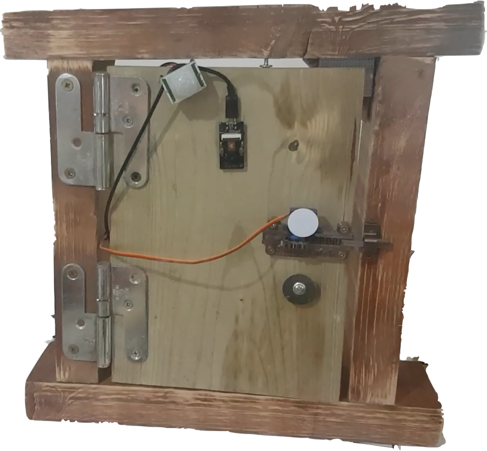
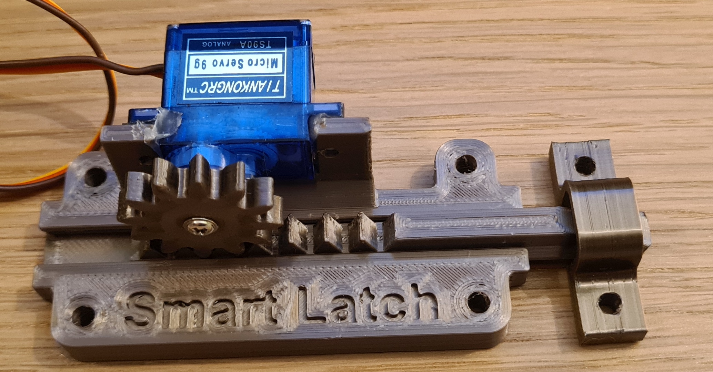

# Smart Latch
IoT project to securely open a door using a combination of NFC technology and facial recognition.

  
   

## Introduction
This file outlines an overview of our Smart Latch IoT system, discussed with specific consideration given to aspects of scalability, security, power consumption and capability for OTA updates. The system is based on the concept of two-factor authentication (2FA) using both NFC and facial recognition technology to provide secure and authorised access to a latch (door). An Android application is used to handle NFC interactions along with user and door management. An ESP-EYE module provides the facial recognition mechanism with a camera feed, while the door itself is controlled by an ESP32 board along with a servo motor.  

## System Overview 
Our system is composed of 3 main components, those being the app, the ESP boards and lastly back end services. As can be observed below, the back end is comprised of multiple sub-components to enhance its scalability. 

#### App
The Android application manages users and door information, allowing users to view and interact with their doors. The app is also responsible for authentication by way of NFC. It includes some other functionality, like capability to upload a selfie to be used by the facial recognition system. 

#### Back end
The app interacts with serverless Google Cloud functions, which enable it to communicate with other servers and a Firebase store, which stores user and door information. Other servers take the form of Google Virtual Machines (VMs) and are used to communicate with ESP32 boards over websocket (WS) connection. Referencing the above architecture diagram, interactions between these services are made scalable by use of a Redis server and load balancer, which manages scalable interactions between the ESP boards and cluster of VMs. A Python Flask server is used to host the facial recognition service, which carries out facial recognition on images submitted to it. 

#### Embedded System
The embedded system consists of two ESP32-based development boards incorporating a range of peripheries. The first is an ESP32 DevKitC core board, which controls the physical latch mechanism using a 9g servo motor. This board also perfroms motion detection by monitoring the HC-SR501 PIR Sensor. An ESP-EYE AIoT module is used to interact with a VM server over a WebSocket connection, providing updates to the back-end on the current latch state and recieving updates on NFC authentications. As this module also incorportates an on-board camera it is used to capture images of users when motion is detected by the other board. Using a light-weight MobileNet architecure, the ESP-EYE module is able to determine whether a face can found within any image that has been captured, all at the edge of the network. The images containing faces are packaged into HTTPS POST requests and sent to the flask facial recognision server. The ESP-EYE module is primarily responsible for checking if both aspects of authentication (NFC and facial recognition) have succeeded. The boards communciate using the high-speed wireless ESP-NOW local communication protcol. This WiFi-based protocol is based on the IEEE 802.11 standard and uses CCMP encryption.

## Scalability  
Since Smart Latch is a solution to less scalable solutions, (keycard access, traditional key etc.) scalability was a primary concern of the project's implementation. Smartphone applications by their nature are scalable in that they can be easily distributed, however more work was required when ensuring our back end and hardware systems remained scalable. Serverless endpoints are created for the app to interface with the back end services using Google cloud functions, which allow new instances of the function to be deployed as traffic increases. On the other side of the infrastructre, communications between the ESP-EYE module and Google VM cloud server component occur over a websocket (WS) connection. As websockets are a persistent connection, it is crucial that they are scalable. Our architecture supports a cluster of virtual machines which will scale to support any amount of websocket connections automatically. A load balancer sits on front of the VM cluster and directs WS traffic to WS servers in the cluster. The individual websokcet servers are synchroized using a redis publisher subscriber architecture. Our cloud can therefore be scaled to support an infinite amount of users. This ensures there is no bottlenecks in the system's ability to scale.

## Security  
As a core consideration of the project, security is upheld to as high a standard as possible in each component of the system. Regarding the app, all communications take place over the `HTTPS` protocol. The user is signed in using the Google OAuth flow, verifying their identity through their Google account. Furthermore, all requests made to the app's back end utilize a token-based authentication scheme, where JWTs are used to authorize all of the user's requests to our back end. This complies with the current best security standards for smartphone applications. In this manner, the back end cloud functions can only be executed by an authorized user, making our back end completely secure. Regarding storage of user data, Google's Firebase is used, drawing on this service's standrard security measures to protect our user data. 

The nature of 2FA and the structure of our system means that the ESP board interfaces with two entirely different services to perform authentication. This decentralisation of the two aspects of authentication means that a malicious entity would need to take control of two servers to perform an attack on a door. This adds an extra security layer to the system. Furthermore, the previously described efforts to increase scalability with a load balancer and also closing websockets after a timeout provides measures against attacks like DDoS. The Redis server is also only accessible from a virtual private connection (VPC) and thus is only internally accessible. 

## Power Consumption
To reduce power consumption in the embedded system the HC-SR501 PIR sensor is used to detect the motion of a potential user, triggering a brief image processing loop on the ESP-EYE to scan for images of the users face. The length of this scanning process is fully configurable, but is maintained to be as short as possible to prevent unnessesary power consumption. As the ESP-EYE module confirms whether a face can be found in an image, only images that actually contain faces are sent to the facial recognision server, preventing unnessesary processing in the backend. The embedded system workload is of-course increased to perfrom the inferening on the ESP32 chip. However, the power consumed by these additional computations is much lower than that consumed by the sending junk images to the backend to be procesed.

## Over-the-air (OTA) updates
Firmware OTA updates are supported which allow the ESP32 and ESP-eye to remotely update their firmware when new versions are available.

 - A new firmware binary can be uploaded to the `smart-latch-esp-firmware` Cloud Storage bucket using naming convention `smart-latch_[version]_[device(esp32/esp-eye)]_.bin`.

 - The ESP device checks for available updates by making a https request to a cloud function. With the request, the device provides the firmware version it is currently running and what device it is (esp32/esp-eye).

 - If the firmware on the cloud bucket is newer, it returns a url to download it.
 
 - The device downloads the `.bin` file, performs the update and reboots.

## Running the code 
### App
Android Studio is required to run the app. Simply open the `client-app` directory in Android Studio. From here the app can be run on an emulator or an Android phone connected over USB. 

